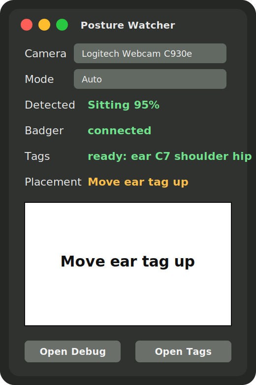
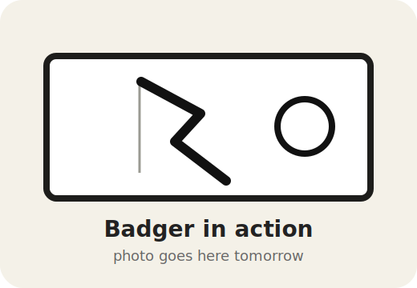

# Posture Watcher

Posture Watcher is a small end-to-end posture feedback loop:

1. A side-mounted webcam watches AprilTags on the ear, C7, shoulder, and optional hip.
2. A Rust analyzer turns those tags into marker geometry, placement diagnostics, and a simple spine/head curve.
3. A Badger2040 e-ink display, used in portrait orientation, shows the feedback where it is easy to glance at while working.
4. A native macOS wrapper owns Camera permission, shows the same display as the Badger, and gives debugging controls when the hardware is not nearby.

The goal is not to nag on every frame. The app samples slowly, averages over a rolling window, and refuses to show a posture curve when the markers are visible but anatomically implausible.

<p align="center">
  
</p>

## Current State

The live loop is working with the plugged-in Logitech C930e and Badger2040:

- The macOS app captures frames through AVFoundation.
- The Rust analyzer detects AprilTags and writes debug images/reports.
- The Badger receiver ACKs messages over USB serial.
- The app distinguishes `Tags ready` from marker placement quality.
- When marker geometry is implausible, the Badger shows a short fix like `Move ear tag up` instead of a misleading curve.

The remaining calibration work is physical: place the tags on the actual landmarks, collect sitting and standing samples, then tune the sitting/standing and placement heuristics against those examples.

## Gallery

| Badger in action | Wearing the tags |
| --- | --- |
|  |  |

The two placeholder images above are intentional. Drop in real photos after the next physical test.

## Hardware

- Badger2040 connected over USB-C.
- Serial port defaults to `/dev/cu.usbmodem83201`.
- Logitech Webcam C930e, mounted sideways for maximum vertical image height.
- AprilTags from the `tag36h11` family.
- Badger should be used vertically, on its short edge, so the 296px axis maps to the body axis.

## First Setup

Build the Rust CLI:

```sh
cargo build
```

Install the Badger receiver:

```sh
cargo run -- install-badger
```

The installer backs up the current Badger `main.py` into `artifacts/badger-backups/`.

Build and launch the macOS app:

```sh
scripts/build-macos-app.sh
open "target/macos/Posture Watcher.app"
```

macOS should prompt for Camera permission as `Posture Watcher`. The app is the preferred daily entry point because it owns the Camera permission flow and feeds captured frames to the bundled Rust analyzer.

## Daily Loop

1. Print the AprilTag sheet:

   ```sh
   cargo run -- stickers --open
   ```

2. Put the tags on:

   - `tag36h11-0`: ear / tragus region
   - `tag36h11-1`: C7
   - `tag36h11-2`: shoulder / acromion
   - `tag36h11-3`: hip / belt marker, optional but useful for sitting/standing

3. Launch the app and check the status rows:

   - `Badger connected` means the e-ink receiver is ACKing payloads.
   - `Tags ready` means the required tags are visible.
   - `Placement good` means the marker geometry is plausible enough to show a curve.
   - `Baseline ready` means both sitting and standing have enough good samples.
   - A placement action like `Move ear tag up` means the tags are visible but probably wrong.

4. Use `Save Sample` whenever you have a useful sitting, standing, good, or bad setup. Samples are saved under:

   ```text
   ~/Library/Application Support/Posture Watcher/samples/<mode>/
   ```

Each saved sample includes the raw frame, debug images, and a `*-tags.txt` report with marker coordinates, detected mode, placement score, and posture measurements.

## Safety Rails

Posture feedback is only useful if the markers are trustworthy. The analyzer therefore keeps tag visibility separate from marker plausibility.

If tags are missing for long enough, the Badger says:

```text
No person found
```

If tags are visible but the geometry is implausible, the Badger gives a short correction:

```text
Move ear tag up
```

That prevents the e-ink display from encouraging posture changes based on bad marker placement. Current placement checks include things like whether the ear marker is actually above C7 and whether the ear-to-C7 angle is geometrically plausible. The fallback message is `Check markers` when the analyzer cannot choose a more specific action.

## Calibration

Calibration has three layers: camera geometry, marker placement, and your own baseline posture. Do them in that order.

### 1. Camera Geometry

Keep the camera boring and repeatable:

- Use the same camera, desk position, and side-view angle each day.
- Keep the C930e sideways and use `--rotate ccw90`.
- Frame the body so ear, C7, shoulder, and hip can all be visible without being tiny.
- Do not move the camera between sitting and standing if you want the app to compare those modes later.

This is why the macOS app owns capture and why the debug report saves image size and marker centers. The posture math is only meaningful if the camera setup is stable.

### 2. Marker Placement

Start by making the app say `Tags ready`, then make it say `Placement good`.

The current placement checks are deliberately simple. They are there to catch setup mistakes like an ear marker that is not above C7, tags that are too small in the frame, or an ear/C7 angle that is geometrically implausible. If the app says `Move ear tag up`, fix the sticker before trusting the curve.

The first useful calibration photo tomorrow is not a heroic posture photo. It is a boring side-view setup photo where the tags are clearly on the intended landmarks.

### 3. Personal Baseline

Do not calibrate against a universal "perfect posture" shape. Calibrate against your own repeatable, comfortable, clinician-approved working positions:

1. Choose `Standing` in the Mode picker.
2. Set up in your normal standing-desk position.
3. Wait until `Placement good`.
4. Hit `Save Sample` three times over a minute.
5. Repeat the same process in `Sitting` mode.

Those saved samples become the reference set for your personal baseline. Once you have a few good samples in each mode, click `Calibrate` in the macOS app or build the baseline file from the CLI:

```sh
cargo run -- calibrate-baseline
```

That command averages only `placement_status=good` reports and writes:

```text
~/Library/Application Support/Posture Watcher/calibration/baseline.txt
```

The live analyzer reads that file while it runs. When a mode baseline is ready, the Badger/app note changes from raw `cva=...` to a compact baseline-relative drift such as `sit -3deg` or `std +2deg`. Sitting and standing each keep their own rolling average window, so switching desk modes does not blend the two postures together.

The app's Baseline row will show `ready`, `need sitting`, `need standing`, or `needs samples` after calibration. `Open Base` opens the generated text file so you can inspect the accepted sample counts and averaged measurements.

### What To Tune Later

Once you have good sitting and standing samples, tune these separately:

- Mode detection: shoulder-to-hip geometry and absolute marker positions.
- Head/neck trend: craniovertebral angle from tragus/ear to C7.
- Shoulder/torso trend: shoulder, C7, and hip relationship.
- Feedback threshold: how far and how long you drift before the Badger should look "off."

The important idea is trend feedback over time. The app should help you notice sustained drift, not force you into a rigid pose.

## Sitting vs Standing

The macOS app shows a first-pass auto-detected Sitting/Standing estimate when shoulder and hip tags are visible. The current heuristic treats a mostly vertical shoulder-to-hip axis as standing, a mostly horizontal shoulder-to-hip axis as sitting, and ambiguous or missing hip geometry as unknown.

The Mode picker is also a live override now. Leave it on `Auto` when the hip tag is placed well; choose `Sitting` or `Standing` when you want the rolling average and baseline drift to use that mode explicitly. The app restarts the analyzer when this changes, but camera capture keeps running.

Keep using the Mode picker as the ground-truth label while saving samples. The saved `latest-tags.txt` reports include:

```text
detected_mode=sitting
detected_mode_confidence=95
placement_status=check
placement_action=Move ear tag up
placement_detail=ear not above C7; ear-C7 angle implausible 1deg
```

## Debugging

Watch the app log:

```sh
scripts/watch-macos-app-log.sh
```

Analyze the current app frame without starting the live loop:

```sh
cargo run -- snapshot \
  --input "$HOME/Library/Application Support/Posture Watcher/latest-frame.jpg" \
  --rotate ccw90 \
  --out-dir artifacts/snapshot
```

Run the full diagnostic:

```sh
cargo run -- doctor
```

Expected checks:

- C930e appears in the camera list.
- A one-frame capture succeeds, or a fresh app frame exists.
- Badger receiver answers `OK,POSTURE_WATCHER_BADGER_V2`.
- Tagged sample analysis detects the posture tags.

## CLI Toolbox

Generate fake tagged samples from `sample-images/`:

```sh
cargo run -- annotate-samples
```

Run the sample sequence and send curves to the Badger:

```sh
cargo run -- run-samples --send-badger
```

Run direct live capture from the CLI:

```sh
cargo run -- live --camera "Logitech Webcam C930e" --port /dev/cu.usbmodem83201
```

Useful live flags:

```sh
cargo run -- live --capture-backend imagesnap
cargo run -- live --capture-backend ffmpeg --ffmpeg-input "0:none"
cargo run -- live --capture-timeout-secs 5
cargo run -- live --rotate none
cargo run -- live --baseline "$HOME/Library/Application Support/Posture Watcher/calibration/baseline.txt"
cargo run -- live --mode sitting
```

Restore the original Badger launcher:

```sh
cargo run -- restore-badger
```

## Notes

Live mode defaults to `--rotate ccw90` because the camera is mounted on its side, `--interval-secs 5`, and a 120-second rolling average. Set `POSTURE_WATCHER_NO_BADGER=1` to use only the macOS preview window.

Optional app overrides:

```sh
POSTURE_WATCHER_CAMERA="Logitech Webcam C930e" \
POSTURE_WATCHER_PORT="/dev/cu.usbmodem83201" \
POSTURE_WATCHER_INTERVAL_SECS=5 \
POSTURE_WATCHER_NO_PERSON_AFTER_SECS=30 \
POSTURE_WATCHER_ROTATE=ccw90 \
open "target/macos/Posture Watcher.app"
```

## Research Notes

This project uses photogrammetry-style marker tracking, not medical diagnosis. The calibration approach is based on a few practical constraints from the literature:

- Craniovertebral angle can be measured reliably from photographs when marker placement and camera setup are controlled: [systematic review on non-radiographic forward-head posture measurement](https://pubmed.ncbi.nlm.nih.gov/35935117/) and [CVA sitting/standing discussion](https://pmc.ncbi.nlm.nih.gov/articles/PMC11042887/).
- Marker placement consistency matters; photogrammetry studies often use calibration/training to align marker methods before measuring posture: [photogrammetry reliability study](https://pmc.ncbi.nlm.nih.gov/articles/PMC11957747/).
- Ergonomics guidance still emphasizes changing positions and avoiding long static postures, even with a well-set workstation: [Mayo Clinic office ergonomics guide](https://www.mayoclinic.org/health/office-ergonomics/MY01460).
