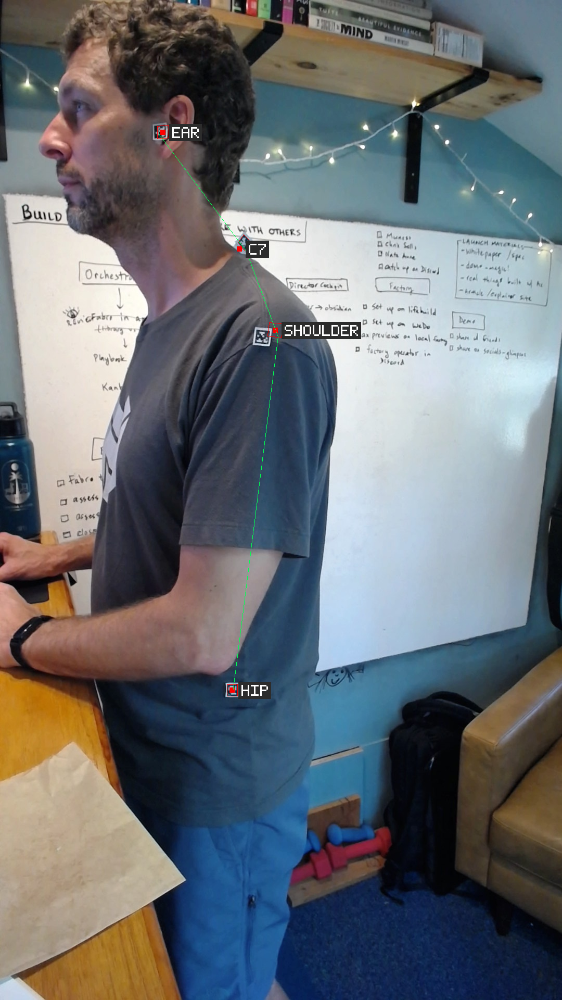
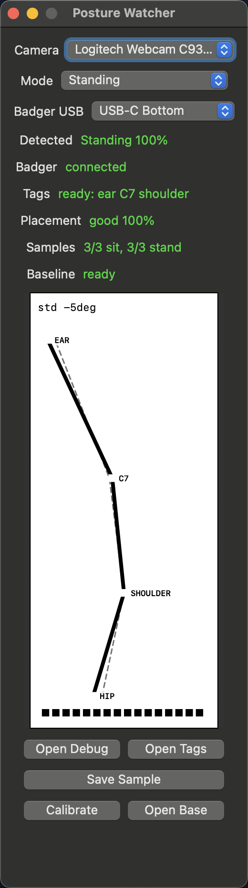
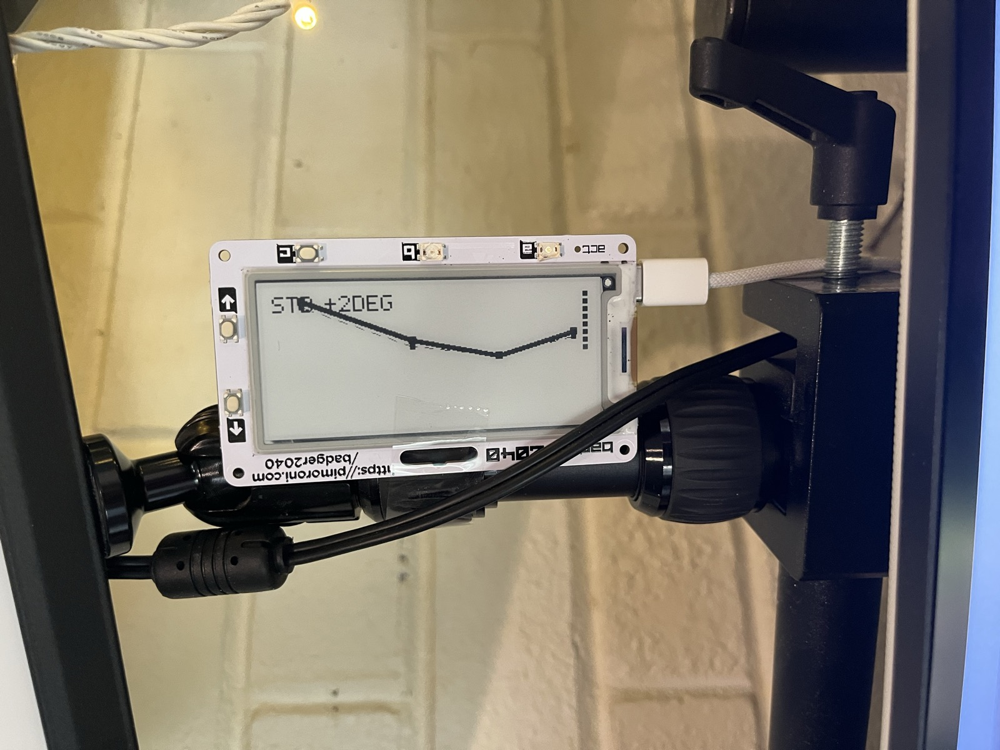
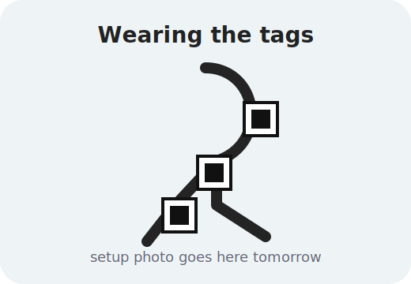
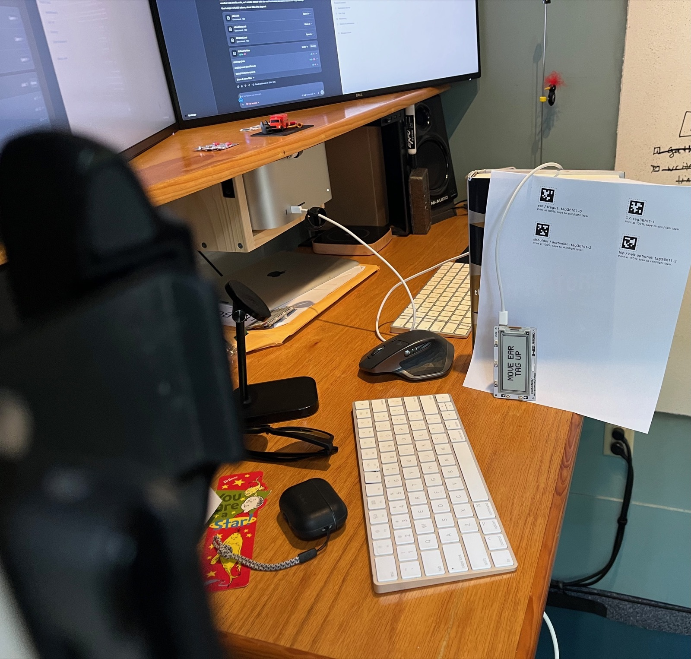
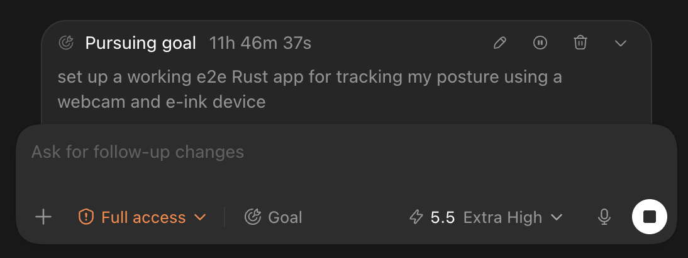
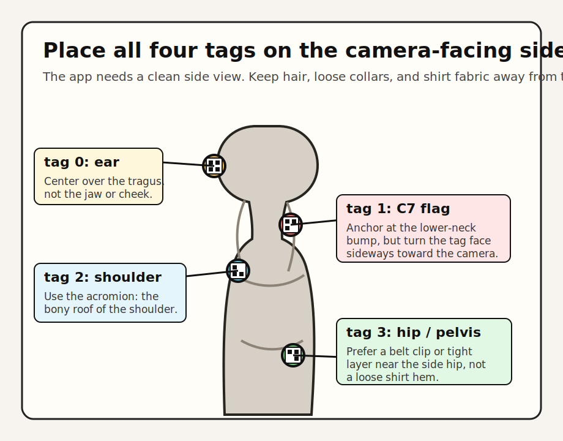

# Posture Watcher

Posture Watcher is a small end-to-end posture feedback loop:

1. A side-mounted webcam watches AprilTags on the ear, C7, shoulder, and optional hip.
2. A Rust analyzer turns those tags into marker geometry, placement diagnostics, and a simple spine/head curve.
3. A Badger2040 e-ink display, used in portrait orientation, shows the feedback where it is easy to glance at while working.
4. A native macOS wrapper owns Camera permission, shows the same display as the Badger, and gives debugging controls when the hardware is not nearby.

The goal is not to nag on every frame. The app samples slowly, averages over a rolling window, and refuses to show a posture curve when the markers are visible but anatomically implausible.

<p align="center">
  
</p>

## Current State

The live loop is working with the plugged-in Logitech C930e and Badger2040:

- The macOS app captures frames through AVFoundation.
- The Rust analyzer inspects a short burst of recent frames, detects AprilTags, fuses the strongest observations, and writes debug images/reports.
- The Badger receiver ACKs messages over USB serial.
- The app distinguishes `Tags ready` from marker placement quality.
- The Badger shows the long-window posture curve against the calibrated sitting/standing baseline instead of treating a straight line as the goal.
- Short marker dropouts are counted but do not immediately replace the curve; sustained marker problems still show a short fix like `Move ear tag up`.

The remaining calibration work is physical: place the tags on the actual landmarks, collect sitting and standing samples, then tune the sitting/standing and placement heuristics against those examples.

## Gallery

| Live debug overlay | macOS app window |
| --- | --- |
|  |  |

| Badger in action | Wearing the tags |
| --- | --- |
|  |  |

The wearing-tags placeholder is intentional. Drop in a real photo after the next physical test.

## How I'm Using It

The Badger sits in portrait orientation just below the monitor, close enough to glance at without turning the setup into another dashboard. The macOS app stays open on the computer as the debugging view, while the e-ink display shows the low-friction posture trace.

<p align="center">
  
</p>

## How I Built It

The hardware loop is deliberately simple: the camera is mounted to the side for a clean profile view, a printed AprilTag sheet provides the daily markers, and the Badger plugs in over USB-C so the Rust analyzer can push the same curve to the desk display.

<p align="center">
  
</p>

The software loop was built with Codex using a long-running `/goal`: "set up a working e2e Rust app for tracking my posture using a webcam and e-ink device." Codex drove the implementation across the Rust analyzer, Badger MicroPython receiver, macOS camera app, hardware checks, README screenshots, and iterative fixes while I tested the physical setup at the desk.

<p align="center">
  
</p>

## Hardware

- Badger2040 connected over USB-C.
- Serial port defaults to `/dev/cu.usbmodem83201`.
- Logitech Webcam C930e, mounted sideways for maximum vertical image height.
- AprilTags from the `tag36h11` family.
- Badger should be used vertically, on its short edge. Use the macOS app's `Badger USB` picker for either `USB-C Top` or `USB-C Bottom`; the receiver rotates the curve and status text to match.

## First Setup

Build the Rust CLI:

```sh
cargo build
```

Install the Badger receiver:

```sh
cargo run -- install-badger
```

The installer backs up the current Badger `main.py` into `artifacts/badger-backups/`.

Build and install the macOS app:

```sh
POSTURE_WATCHER_INSTALL_DIR=/Applications scripts/install-macos-app.sh --open
```

The installer builds `target/macos/Posture Watcher.app`, copies it to `/Applications/Posture Watcher.app`, removes quarantine metadata, and opens the installed copy. macOS should prompt for Camera permission as `Posture Watcher`. The app is the preferred daily entry point because it owns the Camera permission flow and feeds captured frames to the bundled Rust analyzer.

Launch at login is optional:

```sh
POSTURE_WATCHER_INSTALL_DIR=/Applications scripts/install-macos-app.sh --launch-at-login
scripts/disable-launch-at-login.sh
```

## Daily Loop

1. Print the AprilTag sheet:

   ```sh
   cargo run -- stickers --open
   ```

   The sheet includes the four flat tags plus a foldable `C7 side-facing flag template`. Use that flag for `tag36h11-1`; a flat C7 sticker will point backward and disappear from a side camera.

2. Put the tags on:

   - `tag36h11-0`: ear / tragus region
   - `tag36h11-1`: C7, mounted on a small side-facing tab/flag
   - `tag36h11-2`: shoulder / acromion
   - `tag36h11-3`: hip / belt marker, optional but useful for sitting/standing

3. Launch `/Applications/Posture Watcher.app` and check the status rows:

   - `Badger connected` means the e-ink receiver is ACKing payloads.
   - `Tags ready` means the required tags are visible.
   - `Placement good` means the marker geometry is plausible enough to show a curve.
   - `Baseline ready` means both sitting and standing have enough good samples.
   - A placement action like `Move ear tag up` means the tags are visible but probably wrong.

4. Use `Save Sample` whenever you have a useful sitting, standing, good, or bad setup. Samples are saved under:

   ```text
   ~/Library/Application Support/Posture Watcher/samples/<mode>/
   ```

   If the Mode picker is `Auto`, the app saves into `samples/sitting/` or `samples/standing/` when the detected mode is known. Unknown Auto saves go into `samples/auto/` for debugging, but calibration ignores that folder.

Each saved sample includes the raw frame, debug images, and a `*-tags.txt` report with marker coordinates, detected mode, placement score, and posture measurements.

## Burst Sampling

The macOS app writes a rolling burst of camera frames in addition to `latest-frame.jpg`. The Rust analyzer still publishes posture on the slower app interval, but each update is based on the best/fused AprilTag observations from the recent burst. This helps when one frame is blurred, grainy, or catches a tag at a bad angle.

Defaults:

- `POSTURE_WATCHER_INTERVAL_SECS=15`: how often the Badger/posture state updates.
- `POSTURE_WATCHER_BURST_FRAMES=8`: how many recent frames the analyzer inspects per update.
- `POSTURE_WATCHER_BURST_FRAME_INTERVAL_SECS=0.25`: how often the macOS capture loop writes burst frames.

The main Badger line is still based on the rolling posture window, not one instant camera frame. The small strip near the bottom of the display is recent sample quality: filled ticks are usable posture measurements and short marks are missed/invalid updates.

The CLI equivalent is:

```sh
cargo run -- live-file \
  --input "$HOME/Library/Application Support/Posture Watcher/latest-frame.jpg" \
  --burst-dir "$HOME/Library/Application Support/Posture Watcher/burst" \
  --burst-frames 8
```

## Marker Placement Guide

Place every marker on the camera-facing side of your body. The system is a side-view tracker; a beautifully placed sticker on the far side of the body is invisible to the camera.

<p align="center">
  
</p>

The goal is repeatable landmark tracking, not a medical diagnosis. If you can, have a physical therapist or clinician mark C7 and the shoulder landmark once, then take a reference photo so you can repeat the placement later.

### `tag36h11-0`: Ear / Tragus

Put this tag on the side of the face at the tragus region: the small cartilage bump immediately in front of the ear canal. Center the tag near that bump rather than on the cheek, jawline, hair, or earlobe.

Keep hair, glasses arms, headphones, and mask straps from covering the tag. If a skin sticker is annoying, a repeatable small ear-hook, glasses-arm tab, or medical-tape tab can work, but it should land in the same tragus-area position each session.

### `tag36h11-1`: C7

C7 is the prominent bump at the base of the neck. A practical way to find it:

1. Gently bend your head forward and feel for the most prominent lower-neck bump.
2. Gently extend your neck; the C7 bump tends to stay prominent while the segment above it moves more.
3. Put the tag centered over that bump, on skin or a tight collar/undershirt that does not slide.

With the camera at your side, do not stick this AprilTag flat to the back of your neck. A flat C7 sticker points backward, so the side camera sees the edge of the paper instead of the tag face. Use one of these instead:

- Best: a small tape tab or folded cardstock flag anchored over C7, with the printed tag face turned toward the camera.
- Good: a tight collar/undershirt mount at C7 with a small side-facing flap.
- Poor: a flat sticker on the back of the neck or a loose shirt collar.

The anchor point should still be C7, but the readable AprilTag face must be visible to the side camera. If the C7 tag moves with fabric instead of the neck, the app may produce confident-looking but wrong feedback.

Build the C7 flag like a tiny folded place card:

1. Print the generated sticker sheet and cut out the `C7 side-facing flag template`.
2. Put the `ANCHOR` area directly over C7 using skin-safe medical tape or a tight base layer.
3. Fold the tag panel on the dashed line so the tag face points toward the camera. If the camera is on your left, the tag face points left; if the camera is on your right, it points right.
4. Stiffen the flag with a second layer of tape or thin cardstock so it does not curl.
5. Keep the flag as short as visibility allows. If it needs to stick out farther, make it stiff and keep the anchor directly over C7; a long floppy tab will exaggerate neck motion and make the line look more precise than it is.

The app applies a C7 anchor correction for this flag setup. The C7 AprilTag face is not assumed to be the anatomical C7 point; the analyzer uses the tag orientation and shifts the C7 landmark back toward the ear-to-shoulder neck line. The macOS default is `0.75` tag widths and can be changed with `POSTURE_WATCHER_C7_ANCHOR_OFFSET_TAG_WIDTHS`.

### `tag36h11-2`: Shoulder / Acromion

Use the acromion: the bony roof at the outside/top of the shoulder. You can usually find it by tracing the collarbone outward until you reach the flat bony shelf at the shoulder tip.

Put the tag over that bony point, facing the camera. Avoid the upper arm muscle and avoid loose sleeve fabric; both shift more than the landmark the app is trying to track.

### `tag36h11-3`: Hip / Pelvis

This tag is mainly for sitting-vs-standing detection and torso context. Prefer a stable pelvis/side-hip reference over a shirt marker:

- Best repeatability: a belt clip or waistband tab on the camera-facing side, roughly aligned with the side hip / greater trochanter area.
- Good: tape on tight shorts, leggings, or a tucked-in tight base layer.
- Poor: a tag on a loose shirt hem, because it can drift independently of your pelvis.

If the hip tag is hard to place, leave the Mode picker on `Sitting` or `Standing` while saving calibration samples. Auto mode needs the hip tag to be trustworthy.

### Daily Placement Check

Before trusting the curve, look for this sequence in the app:

1. `Tags ready`: all required tags are visible.
2. `Placement good`: the tag geometry is plausible.
3. `Detected Sitting` or `Detected Standing`: mode detection agrees with your actual desk mode, or you have selected the mode manually.

If the app says `Aim C7 flag`, `Move ear tag up`, `Recheck ear and C7`, `Move shoulder tag down`, or `Move closer`, treat that as a setup problem. Fix the stickers before saving calibration samples or responding to the Badger curve.

## Safety Rails

Posture feedback is only useful if the markers are trustworthy. The analyzer therefore keeps tag visibility separate from marker plausibility.

If no tags are visible for long enough, the Badger says:

```text
No person found
```

If tags are visible but the geometry is implausible for several consecutive updates, the Badger gives a short correction:

```text
Move ear tag up
```

If the side camera can see the ear and shoulder but not C7, the Badger/app will instead point you at the physical flag setup:

```text
Aim C7 flag
```

That prevents the e-ink display from encouraging posture changes based on bad marker placement, while avoiding flicker from momentary occlusions. Current placement checks include things like whether the ear marker is actually above C7 and whether the ear-to-C7 angle is geometrically plausible. The fallback message is `Check markers` when the analyzer cannot choose a more specific action.

## Calibration

Calibration has three layers: camera geometry, marker placement, and your own baseline posture. Do them in that order.

### 1. Camera Geometry

Keep the camera boring and repeatable:

- Use the same camera, desk position, and side-view angle each day.
- Keep the C930e sideways and use `--rotate ccw90`.
- Frame the body so ear, C7, shoulder, and hip can all be visible without being tiny.
- Do not move the camera between sitting and standing if you want the app to compare those modes later.

This is why the macOS app owns capture and why the debug report saves image size and marker centers. The posture math is only meaningful if the camera setup is stable.

### 2. Marker Placement

Start by making the app say `Tags ready`, then make it say `Placement good`.

The current placement checks are deliberately simple. They are there to catch setup mistakes like an ear marker that is not above C7, tags that are too small in the frame, or an ear/C7 angle that is geometrically implausible. If the app says `Move ear tag up`, fix the sticker before trusting the curve.

The first useful calibration photo tomorrow is not a heroic posture photo. It is a boring side-view setup photo where the tags are clearly on the intended landmarks.

### 3. Personal Baseline

Do not calibrate against a universal "perfect posture" shape. Calibrate against your own repeatable, comfortable, clinician-approved working positions:

1. Choose `Standing` in the Mode picker.
2. Set up in your normal standing-desk position.
3. Wait until `Placement good`.
4. Hit `Save Sample` three times over a minute.
5. Repeat the same process in `Sitting` mode.

Those saved samples become the reference set for your personal baseline. Once you have a few good samples in each mode, click `Calibrate` in the macOS app or build the baseline file from the CLI:

```sh
cargo run -- calibrate-baseline
```

That command averages only `placement_status=good` reports and writes:

```text
~/Library/Application Support/Posture Watcher/calibration/baseline.txt
```

The live analyzer reads that file while it runs. When a mode baseline is ready, the Badger/app note changes from raw `cva=...` to a compact baseline-relative drift such as `sit -3deg` or `std +2deg`, and the display draws a thin dashed baseline curve behind the thicker live rolling-average curve. Sitting and standing each keep their own rolling average window, so switching desk modes does not blend the two postures together.

The app's Baseline row will show `ready`, `need sitting`, `need standing`, or `needs samples` after calibration. `Open Base` opens the generated text file so you can inspect the accepted sample counts and averaged measurements.

The app's Samples row counts only good sitting and standing reports. If it shows `0/3 sit, 0/3 stand`, you either have not saved enough samples yet or the saved reports still say `placement_status=check`.

### What To Tune Later

Once you have good sitting and standing samples, tune these separately:

- Mode detection: shoulder-to-hip geometry and absolute marker positions.
- Head/neck trend: craniovertebral angle from tragus/ear to C7.
- Shoulder/torso trend: shoulder, C7, and hip relationship.
- Feedback threshold: how far and how long you drift before the Badger should look "off."

The important idea is trend feedback over time. The app should help you notice sustained drift, not force you into a rigid pose.

## Sitting vs Standing

The macOS app shows a first-pass auto-detected Sitting/Standing estimate when shoulder and hip tags are visible. The current heuristic treats a mostly vertical shoulder-to-hip axis as standing, a mostly horizontal shoulder-to-hip axis as sitting, and ambiguous or missing hip geometry as unknown.

The Mode picker is also a live override now. Leave it on `Auto` when the hip tag is placed well; choose `Sitting` or `Standing` when you want the rolling average and baseline drift to use that mode explicitly. The app restarts the analyzer when this changes, but camera capture keeps running.

Keep using the Mode picker as the ground-truth label while saving samples. The saved `latest-tags.txt` reports include:

```text
detected_mode=sitting
detected_mode_confidence=95
placement_status=check
placement_action=Move ear tag up
placement_detail=ear not above C7; ear-C7 angle implausible 1deg
```

## Debugging

Watch the app log:

```sh
scripts/watch-macos-app-log.sh
```

Analyze the current app frame without starting the live loop:

```sh
cargo run -- snapshot \
  --input "$HOME/Library/Application Support/Posture Watcher/latest-frame.jpg" \
  --rotate ccw90 \
  --out-dir artifacts/snapshot
```

Run the full diagnostic:

```sh
cargo run -- doctor
```

Expected checks:

- C930e appears in the camera list.
- A one-frame capture succeeds, or a fresh app frame exists.
- Badger receiver answers `OK,POSTURE_WATCHER_BADGER_V2`.
- Tagged sample analysis detects the posture tags.
- Baseline/manual-mode smoke produces a baseline-relative Badger note.

## CLI Toolbox

Generate fake tagged samples from `sample-images/`:

```sh
cargo run -- annotate-samples
```

Run the sample sequence and send curves to the Badger:

```sh
cargo run -- run-samples --send-badger
```

Run direct live capture from the CLI:

```sh
cargo run -- live --camera "Logitech Webcam C930e" --port /dev/cu.usbmodem83201
```

Useful live flags:

```sh
cargo run -- live --capture-backend imagesnap
cargo run -- live --capture-backend ffmpeg --ffmpeg-input "0:none"
cargo run -- live --capture-timeout-secs 5
cargo run -- live --rotate none
cargo run -- live --baseline "$HOME/Library/Application Support/Posture Watcher/calibration/baseline.txt"
cargo run -- live --mode sitting
cargo run -- live-file --input "artifacts/tagged-samples/<sample>-tagged.png" --rotate none --once --no-badger
```

Restore the original Badger launcher:

```sh
cargo run -- restore-badger
```

## Notes

Live mode defaults to `--rotate ccw90` because the camera is mounted on its side, `--interval-secs 15`, and a 120-second rolling average. Set `POSTURE_WATCHER_NO_BADGER=1` to use only the macOS preview window.

Optional app overrides:

```sh
POSTURE_WATCHER_CAMERA="Logitech Webcam C930e" \
POSTURE_WATCHER_PORT="/dev/cu.usbmodem83201" \
POSTURE_WATCHER_INTERVAL_SECS=15 \
POSTURE_WATCHER_NO_PERSON_AFTER_SECS=60 \
POSTURE_WATCHER_ROTATE=ccw90 \
POSTURE_WATCHER_BADGER_ORIENTATION=usb-bottom \
open "target/macos/Posture Watcher.app"
```

## Research Notes

This project uses photogrammetry-style marker tracking, not medical diagnosis. The calibration approach is based on a few practical constraints from the literature:

- Craniovertebral angle can be measured reliably from photographs when marker placement and camera setup are controlled: [systematic review on non-radiographic forward-head posture measurement](https://pubmed.ncbi.nlm.nih.gov/35935117/) and [CVA sitting/standing discussion](https://pmc.ncbi.nlm.nih.gov/articles/PMC11042887/).
- The ear/C7 placement follows common CVA photogrammetry practice: markers on the tragus region and C7 spinous process, with lateral photos from a fixed side view: [CVA reliability study](https://pmc.ncbi.nlm.nih.gov/articles/PMC12777732/) and [radiography vs. photogrammetry comparison](https://pubmed.ncbi.nlm.nih.gov/38610914/).
- The shoulder/hip landmarks are support markers for body-axis context, based on sagittal posture work that commonly uses the acromion and greater trochanter: [sagittal posture guidelines](https://www.mdpi.com/2813-0545/4/2/5).
- Marker placement consistency matters; photogrammetry studies often use calibration/training to align marker methods before measuring posture: [photogrammetry reliability study](https://pmc.ncbi.nlm.nih.gov/articles/PMC11957747/).
- Ergonomics guidance still emphasizes changing positions and avoiding long static postures, even with a well-set workstation: [Mayo Clinic office ergonomics guide](https://www.mayoclinic.org/health/office-ergonomics/MY01460).
